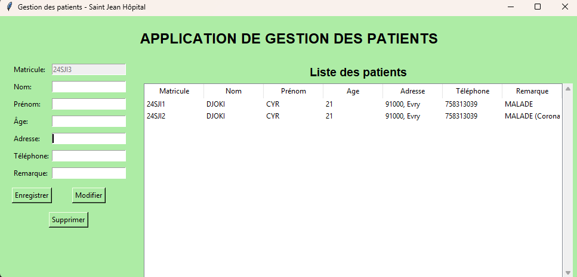

# Application de gestion des patients

Cette application a été développée durant mes classes préparatoires, dans le cadre d’un projet encadré à partir d’un cahier des charges précis.
Elle a pour objectif de faciliter la gestion des dossiers patients pour un établissement hospitalier.

## 🛠Fonctionnalités

- Ajout, modification et suppression de patients
- Génération automatique du matricule (format : 24SJI1)
- Affichage dynamique avec `Treeview`
- Interface graphique conviviale (design vert)
- Connexion à une base MySQL locale

## Technologies utilisées

- Python 3
- Tkinter (interface graphique)
- MySQL (via phpMyAdmin)

## Comment lancer le projet ?

1. Cloner le dépôt GitHub
2. Ouvrir le dossier cloné dans votre éditeur (ex. : VS Code)
3. Importer la base de données 'hopital.sql' : Lancer phpMyAdmin, Créer une base de données nommée hopital, Importer le fichier hopital.sql fourni dans le dépôt, Vérifier que MySQL est bien actif (via XAMPP, WAMP ou autre)
4. Lancer l’application Python (Fichier à exécuter : Gestion des patients de Saint Jean Hôpital.py)

L'application s’ouvre avec une interface graphique (Tkinter) et est prête à être utilisée : ajouter, modifier, supprimer des patients avec interface graphique et base connectée.

## Auteur
Projet réalisé en classe préparatoire – Prepa Saint Jean 
  
